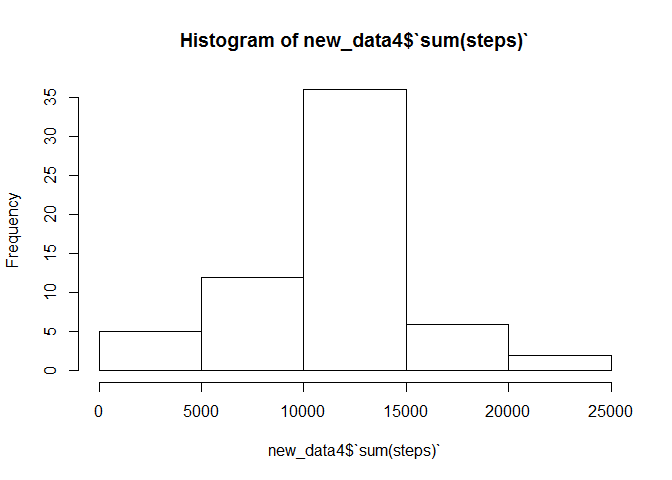

# Reproducible Research: Peer Assessment 1


## Loading and preprocessing the data

```r
library(dplyr)
```

```
## 
## Attaching package: 'dplyr'
## 
## The following object is masked from 'package:stats':
## 
##     filter
## 
## The following objects are masked from 'package:base':
## 
##     intersect, setdiff, setequal, union
```

```r
data <- read.csv("activity.csv")
data <- tbl_df(data)
```


## What is mean total number of steps taken per day?

```r
new_data <- summarise(group_by(data,date),sum(steps))
hist(new_data$`sum(steps)`)
```

 

```r
mean(new_data$`sum(steps)`, na.rm = TRUE)
```

```
## [1] 10766.19
```

```r
median(new_data$`sum(steps)`, na.rm = TRUE)
```

```
## [1] 10765
```

## What is the average daily activity pattern?

```r
new_data2 <- summarise(group_by(data,interval),mean(steps, na.rm = TRUE))
plot(new_data2$interval,new_data2$`mean(steps, na.rm = TRUE)`, type = "l", xlab = "interval", ylab = "meanstepsAcrossDays")
```

 

```r
maxstep <- new_data2[new_data2$`mean(steps, na.rm = TRUE)` == max(new_data2$`mean(steps, na.rm = TRUE)`),][1]
```
The interval with max average steps is 835 .  


## Imputing missing values

```r
countNA <- count(data[is.na(data$steps),])
```
There are 2304 NA in the original data set  

The NA value in the original data is filled by the average of steps of each interval across days


```r
new_data3 <- data[is.na(data$steps),]
data3 <- merge(new_data3, new_data2, by.x = "interval", all.x = TRUE)
data4 <- data[!is.na(data$steps),]
data3$steps = NULL
data3<-setNames(data3, c("interval", "date", "steps"))
data5 <- rbind(data3, data4)
data5<-data5[order(data5$date),]
data5 <- tbl_df(data5)
data5
```

```
## Source: local data frame [17,568 x 3]
## 
##    interval       date     steps
## 1         0 2012-10-01 1.7169811
## 2         5 2012-10-01 0.3396226
## 3        10 2012-10-01 0.1320755
## 4        15 2012-10-01 0.1509434
## 5        20 2012-10-01 0.0754717
## 6        25 2012-10-01 2.0943396
## 7        30 2012-10-01 0.5283019
## 8        35 2012-10-01 0.8679245
## 9        40 2012-10-01 0.0000000
## 10       45 2012-10-01 1.4716981
## ..      ...        ...       ...
```


```r
new_data4 <- summarise(group_by(data5,date),sum(steps))
hist(new_data4$`sum(steps)`)
```

 

```r
mean(new_data4$`sum(steps)`, na.rm = TRUE)
```

```
## [1] 10766.19
```

```r
median(new_data4$`sum(steps)`, na.rm = TRUE)
```

```
## [1] 10766.19
```
The median is slightly higher and the mean remains the same under this method.  


## Are there differences in activity patterns between weekdays and weekends?

```r
data5$WD <- weekdays(strptime(data5$date, "%Y-%m-%d"))
weekdays_set = c("Monday","Tuesday","Wednesday","Thursday","Friday")
data5$WD <- factor((data5$WD %in% weekdays_set), levels=c(FALSE, TRUE), labels=c('weekend', 'weekday'))
data5
```

```
## Source: local data frame [17,568 x 4]
## 
##    interval       date     steps      WD
## 1         0 2012-10-01 1.7169811 weekday
## 2         5 2012-10-01 0.3396226 weekday
## 3        10 2012-10-01 0.1320755 weekday
## 4        15 2012-10-01 0.1509434 weekday
## 5        20 2012-10-01 0.0754717 weekday
## 6        25 2012-10-01 2.0943396 weekday
## 7        30 2012-10-01 0.5283019 weekday
## 8        35 2012-10-01 0.8679245 weekday
## 9        40 2012-10-01 0.0000000 weekday
## 10       45 2012-10-01 1.4716981 weekday
## ..      ...        ...       ...     ...
```

```r
str(data5)
```

```
## Classes 'tbl_df', 'tbl' and 'data.frame':	17568 obs. of  4 variables:
##  $ interval: int  0 5 10 15 20 25 30 35 40 45 ...
##  $ date    : Factor w/ 61 levels "2012-10-01","2012-10-02",..: 1 1 1 1 1 1 1 1 1 1 ...
##  $ steps   : num  1.717 0.3396 0.1321 0.1509 0.0755 ...
##  $ WD      : Factor w/ 2 levels "weekend","weekday": 2 2 2 2 2 2 2 2 2 2 ...
```


```r
data5_1 <- data5[data5$WD == "weekday",]
data5_2 <- data5[data5$WD == "weekend",]
new_data51 <- summarise(group_by(data5_1,interval),mean(steps))
new_data52 <- summarise(group_by(data5_2,interval),mean(steps))
par(mfrow = c(2,1))
plot(new_data51$interval,new_data51$`mean(steps)`, type = "l", xlab = "interval", ylab = "meanstepsAcrossWeekDays")
plot(new_data52$interval,new_data52$`mean(steps)`, type = "l", xlab = "interval", ylab = "meanstepsAcrossWeekEnds")
```

 

